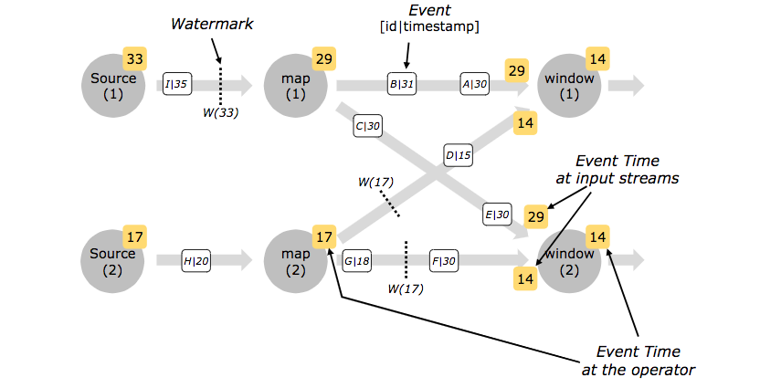

# 【Flink】Flink Watermark 机制浅析

[toc]

## 一、前言

Flink 为实时计算提供了三种时间，即事件时间（event time）、摄入时间（ingestion time）和处理时间（processing time）。在进行 window 计算时，使用摄入时间或处理时间的消息都是以系统的墙上时间（wall clocks）为标准，因此事件都是按序到达的。然而如果使用更为有意义的事件时间则会需要面对乱序事件问题（out-of-order events）和迟到事件问题（late events）。针对这两个问题，Flink 主要采用了以水位线（watermark）为核心的机制来应对。

## 二、Time

针对stream数据中的时间，可以分为以下三种：

- Event Time：事件产生的时间，它通常由事件中的时间戳描述。在 `Event Time` 中，时间值取决于数据，而不取决于系统时间。 `Event Time` 程序必须指定如何生成 `Event Time` 的 `Watermark`，这是表示 `Event Time` 进度的机制。
- Ingestion time：事件进入Flink的时间。由于 `Ingestion Time` 使用稳定的时间戳（在源处分配了一次），因此对记录的不同窗口操作将引用相同的时间戳，而在 `Processing Time` 中，每个窗口的算子 `Operator` 都可以将记录分配给不同的窗口（基于本地系统时间和到达延误）。
- Processing Time：事件被处理时当前系统的时间。Processing Time` 是最简单的时间概念，不需要流和机器之间的协调。它提供了最佳的性能和最低的延迟。但是，在分布式和异步环境中，`Processing Time` 不能提供确定性，因为它容易受到记录到达系统（例如从消息队列）到达系统的速度，记录在系统内部操作员之间流动的速度的影响，以及中断（计划的或其他方式）。


## 三、乱序事件场景和 watermark

可以参考该文理解：[Flink 小贴士 (3): 轻松理解 Watermark](http://wuchong.me/blog/2018/11/18/flink-tips-watermarks-in-apache-flink-made-easy/)

watermark 是用于处理乱序事件的，而正确的处理乱序事件，通常用watermark机制结合window来实现。

流处理从事件产生，到流经source，再到operator，中间是有一个过程和时间的。虽然大部分情况下，流到operator的数据都是按照事件产生的时间顺序来的，但是也不排除由于网络、背压等原因，导致乱序的产生（out-of-order或者说late element）。

但是对于late element，我们又不能无限期的等下去，必须要有个机制来保证一个特定的时间后，必须触发window去进行计算了。这个特别的机制，就是watermark。

**Flink 使用 `Watermark` 来记录事件进行的进度，用收集到的消息来评估事件进度，判断还有没有事件没有到达，只有 `Watermark` 越过了时间窗口设定的时间，才认为窗口已经收集好数据。**

**`Watermark` 作为数据流的一部分流动，并带有时间戳 `t`。 `Watermark(t)` 声明事件时间已在该流中达到时间 `t`，这意味着该流中不应再有时间戳 `t'<= t` 的元素（即时间戳早于或等于 `Watermark` 的事件）。**

举个具体一点的例子，设定了一个 3s 的时间窗口还有 10s 的乱序延时：

```scala
long maxUnOrderWatermark = 10000L; // watermark 设定成 当前时间戳 - 延时 
new Watermark(currentTimeStamp - maxUnOrderWatermark); 
```

在 [00:01 : 00:03] 窗口时间过去后，搜集到了 3 个时间，但是窗口先不触发计算，等待有可能延迟的事件。

例如在 06s 又有一个前面窗口的事件到来，由于在设定的延时时间内，它会被分配到正确窗口中，窗口中的元素变成了 4 个，然后在后续有新事件来临，`watermark` 被更新成大于 00:03，**这时 `Watermark` > 窗口结束时间，触发窗口计算，解决了事件延时到达的问题。**

**`watermark`  决定了窗口的触发时间，这正是 watermark 的作用，它定义了何时不再等待更早的数据。窗口的触发时机就是：**

```
watermark 时间 >= window_end_time
```

窗触发时，数据除了正常的时间序列，同时也包含延时到达的序列。在窗触发前，计算除了把之前的正常窗数据给触发了，同时还包含了本来也属于该窗的延时数据。

## 四、watermark 的分配

通常，在接收到source的数据后，应该立刻生成watermark；但是，也可以在source后，应用简单的map或者filter操作后，再生成watermark。注意：如果指定多次watermark，后面指定的会覆盖前面的值。

生成 watermark 的方式主要有2大类：

* With Periodic Watermarks
* With Punctuated Watermarks

### 4.1、With Periodic Watermarks

周期性水位线（Periodic Watermark）按照固定时间间隔生成新的水位线，不管是否有新的消息抵达。水位线提升的时间间隔是由用户设置的，在两次水位线提升时隔内会有一部分消息流入，用户可以根据这部分数据来计算出新的水位线。

举个例子，最简单的水位线算法就是取目前为止最大的事件时间，然而这种方式比较暴力，对乱序事件的容忍程度比较低，容易出现大量迟到事件。

每次调用 getCurrentWatermark 方法，如果得到的 WATERMARK  不为空并且比之前的大就注入流中，可以定义一个最大允许乱序的时间，这种比较常用。

应用定期水位线需要实现`AssignerWithPeriodicWatermarks` API：

```scala
class BoundedOutOfOrdernessGenerator extends AssignerWithPeriodicWatermarks[MyEvent] {
    val maxOutOfOrderness = 3500L; // 3.5 seconds
    var currentMaxTimestamp: Long;
    override def extractTimestamp(element: MyEvent, previousElementTimestamp: Long): Long = {
        val timestamp = element.getCreationTime()
        currentMaxTimestamp = max(timestamp, currentMaxTimestamp)
        timestamp;
    }
    override def getCurrentWatermark(): Watermark = {
        // return the watermark as current highest timestamp minus the out-of-orderness bound
        new Watermark(currentMaxTimestamp - maxOutOfOrderness);
    }
}
```

其中`extractTimestamp`用于从消息中提取事件时间，而`getCurrentWatermark`用于生成新的水位线，新的水位线只有大于当前水位线才是有效的。每个窗口都会有该类的一个实例，因此可以利用实例的成员变量保存状态，比如上例中的当前最大时间戳。

### 4.2、With Punctuated Watermarks

标点水位线（Punctuated Watermark）通过数据流中某些特殊标记事件来触发新水位线的生成。这种方式下窗口的触发与时间无关，而是决定于何时收到标记事件。每一个元素都有机会判断是否生成一个WATERMARK，如果得到 WATERMARK  不为空并且比之前的大就注入流中。

标点水位线需要实现`AssignerWithPunctuatedWatermarks` API：

```scala
class PunctuatedAssigner extends AssignerWithPunctuatedWatermarks[MyEvent] {
    override def extractTimestamp(element: MyEvent, previousElementTimestamp: Long): Long = {
        element.getCreationTime
    }
    override def checkAndGetNextWatermark(lastElement: MyEvent, extractedTimestamp: Long): Watermark = {
        if (element.hasWatermarkMarker()) new Watermark(extractedTimestamp) else null
    }
}
```

其中`extractTimestamp`用于从消息中提取事件时间，`checkAndGetNextWatermark`用于检查事件是否标点事件，若是则生成新的水位线。不同于定期水位线定时调用`getCurrentWatermark`，标点水位线是每接受一个事件就需要调用`checkAndGetNextWatermark`，若返回值非 null 且新水位线大于当前水位线，则触发窗口计算。

## 五、Watermark 案例实战

基于事件序列最大值 Watermark：

```scala
import java.text.SimpleDateFormat

import org.apache.flink.streaming.api.scala._
import org.apache.flink.streaming.api.TimeCharacteristic
import org.apache.flink.streaming.api.functions.AssignerWithPeriodicWatermarks
import org.apache.flink.streaming.api.scala.StreamExecutionEnvironment
import org.apache.flink.streaming.api.scala.function.WindowFunction
import org.apache.flink.streaming.api.watermark.Watermark
import org.apache.flink.streaming.api.windowing.assigners.TumblingEventTimeWindows
import org.apache.flink.streaming.api.windowing.time.Time
import org.apache.flink.streaming.api.windowing.windows.TimeWindow
import org.apache.flink.util.Collector

/**
  *
  * 0001,1538359882000		2018-10-01 10:11:22
  * 0002,1538359886000		2018-10-01 10:11:26
  * 0003,1538359892000		2018-10-01 10:11:32
  * 0004,1538359893000		2018-10-01 10:11:33
  * 0005,1538359894000		2018-10-01 10:11:34
  * 0006,1538359896000		2018-10-01 10:11:36
  * 0007,1538359897000		2018-10-01 10:11:37
  *
  * 0008,1538359899000		2018-10-01 10:11:39
  * 0009,1538359891000		2018-10-01 10:11:31
  * 0010,1538359903000		2018-10-01 10:11:43
  *
  * 0011,1538359892000		2018-10-01 10:11:32
  * 0012,1538359891000		2018-10-01 10:11:31
  *
  * 0010,1538359906000		2018-10-01 10:11:46
  * 
  *
  * @author w1992wishes 2020/7/17 14:22
  */
object PeriodicWatermarkDetail {

  def main(args: Array[String]): Unit = {
    //定义socket的端口号
    val port = 9010
    //获取运行环境
    val env = StreamExecutionEnvironment.getExecutionEnvironment
    //设置使用eventtime，默认是使用processtime
    env.setStreamTimeCharacteristic(TimeCharacteristic.EventTime)
    //设置并行度为1,默认并行度是当前机器的cpu数量
    env.setParallelism(1)
    //连接socket获取输入的数据
    val text = env.socketTextStream("localhost", port)

    //解析输入的数据
    val inputMap = text.map(
      f => {
        val arr = f.split(",")
        val code = arr(0)
        val time = arr(1).toLong
        (code, time)
      }
    )

    //抽取timestamp和生成watermark
    val waterMarkStream = inputMap.assignTimestampsAndWatermarks(new AssignerWithPeriodicWatermarks[(String, Long)] {

      var currentMaxTimestamp = 0L
      val maxOutOfOrderness = 10000L // 最大允许的乱序时间是10s

      val sdf = new SimpleDateFormat("yyyy-MM-dd HH:mm:ss.SSS")

      override def getCurrentWatermark: Watermark = {
        new Watermark(currentMaxTimestamp - maxOutOfOrderness)
      }

      //定义如何提取timestamp
      override def extractTimestamp(element: (String, Long), l: Long): Long = {
        val timestamp = element._2
        currentMaxTimestamp = Math.max(timestamp, currentMaxTimestamp)
        println("键值:" + element._1 + ", 事件事件: [" + sdf.format(element._2) + "], currentMaxTimestamp: [" +
          sdf.format(currentMaxTimestamp) + "], watermark 时间: [" + sdf.format(getCurrentWatermark().getTimestamp) + "]")
        timestamp
      }
    })

    val window = waterMarkStream
      .keyBy(_._1)
      .window(TumblingEventTimeWindows.of(Time.seconds(3))) //按照消息的EventTime分配窗口，和调用TimeWindow效果一样
      .apply(new WindowFunctionTest)

    //测试-把结果打印到控制台即可
    window.print()

    //注意：因为flink是懒加载的，所以必须调用execute方法，上面的代码才会执行
    env.execute("eventtime-watermark")

  }

  class WindowFunctionTest extends WindowFunction[(String, Long), (String), String, TimeWindow] {
    /**
      * 对window内的数据进行排序，保证数据的顺序
      */
    override def apply(key: String, window: TimeWindow, input: Iterable[(String, Long)], out: Collector[String]): Unit = {
      val list = input.toList.sortBy(_._2)
      val format = new SimpleDateFormat("yyyy-MM-dd HH:mm:ss.SSS")
      val result =
        s"""
           |"键值: $key
           | 触发窗内数据个数: ${input.size}
           | 触发窗起始数据：${format.format(list.head._2)}
           | 触发窗最后（可能是延时）数据：${format.format(list.last._2)}
           | 实际窗起始和结束时间：${format.format(window.getStart)}《----》${format.format(window.getEnd)} \n
        """.stripMargin
      out.collect(result)
    }
  }

}
```

## 六、迟到事件

虽说水位线表明着早于它的事件不应该再出现，但是上如上文所讲，接收到水位线以前的的消息是不可避免的，这就是所谓的迟到事件。实际上迟到事件是乱序事件的特例，和一般乱序事件不同的是它们的乱序程度超出了水位线的预计，导致窗口在它们到达之前已经关闭。

迟到事件出现时窗口已经关闭并产出了计算结果，因此处理的方法有3种：

1. 重新激活已经关闭的窗口并重新计算以修正结果。
2. 将迟到事件收集起来另外处理。
3. 将迟到事件视为错误消息并丢弃。

Flink 默认的处理方式是第3种直接丢弃，其他两种方式分别使用`Side Output`和`Allowed Lateness`。

`Side Output`机制可以将迟到事件单独放入一个数据流分支，这会作为 window 计算结果的副产品，以便用户获取并对其进行特殊处理。

`Allowed Lateness`机制允许用户设置一个允许的最大迟到时长。Flink 会再窗口关闭后一直保存窗口的状态直至超过允许迟到时长，这期间的迟到事件不会被丢弃，而是默认会触发窗口重新计算。因为保存窗口状态需要额外内存，并且如果窗口计算使用了 `ProcessWindowFunction` API 还可能使得每个迟到事件触发一次窗口的全量计算，代价比较大，所以允许迟到时长不宜设得太长，迟到事件也不宜过多，否则应该考虑降低水位线提高的速度或者调整算法。

### 6.1、举例

在某些情况下， 我们希望对迟到的数据再提供一个宽容的时间。 Flink 提供了 allowedLateness 方法可以实现对迟到的数据设置一个延迟时间， 在指定延迟时间内到达的数据还是可以触发 window 执行的。

**第二次（或多次）触发的条件是 watermark < window_end_time + allowedLateness 时间内**， 这个窗口有 late 数据到达时。

举例：当 watermark 等于 10:11:34 的时候， 我们输入 eventtime 为 10:11:30、 10:11:31、10:11:32 的数据的时候， 是可以触发的， 因为这些数据的 window_end_time 都是 10:11:33， 也就是10:11:34<10:11:33+2 为 true。

举例：但是当 watermark 等于 10:11:35 的时候，我们再输入 eventtime 为 10:11:30、10:11:31、10:11:32的数据的时候， 这些数据的 window_end_time 都是 10:11:33， 此时， 10:11:35< 10:11:33+2 为false 了。 所以最终这些数据迟到的时间太久了， 就不会再触发 window 执行了，预示着丢弃。

同时注意，对于延迟的数据，我们完全可以把它揪出来作分析。通过设置sideOutputLateData。

### 6.2、实战

```scala
import java.text.SimpleDateFormat

import me.w1992wishes.flink.details.watermark.PeriodicWatermarkDetail.WindowFunctionTest
import org.apache.flink.streaming.api.scala._
import org.apache.flink.streaming.api.TimeCharacteristic
import org.apache.flink.streaming.api.functions.AssignerWithPeriodicWatermarks
import org.apache.flink.streaming.api.scala.StreamExecutionEnvironment
import org.apache.flink.streaming.api.watermark.Watermark
import org.apache.flink.streaming.api.windowing.assigners.TumblingEventTimeWindows
import org.apache.flink.streaming.api.windowing.time.Time

/**
  * @author w1992wishes 2020/7/17 15:36
  */
object SideOutDetail {

  def main(args: Array[String]): Unit = {
    //定义socket的端口号
    val port = 9000
    //获取运行环境
    val env = StreamExecutionEnvironment.getExecutionEnvironment
    //设置使用eventtime，默认是使用processtime
    env.setStreamTimeCharacteristic(TimeCharacteristic.EventTime)
    //设置并行度为1,默认并行度是当前机器的cpu数量
    env.setParallelism(1)
    //连接socket获取输入的数据
    val text = env.socketTextStream("localhost", port)

    //解析输入的数据
    val inputMap = text.map(
      f => {
        val arr = f.split(",")
        val code = arr(0)
        val time = arr(1).toLong
        (code, time)
      }
    )

    //抽取timestamp和生成watermark
    val waterMarkStream = inputMap.assignTimestampsAndWatermarks(new AssignerWithPeriodicWatermarks[(String, Long)] {

      var currentMaxTimestamp = 0L
      val maxOutOfOrderness = 10000L // 最大允许的乱序时间是10s

      val sdf = new SimpleDateFormat("yyyy-MM-dd HH:mm:ss.SSS")

      override def getCurrentWatermark: Watermark = {
        new Watermark(currentMaxTimestamp - maxOutOfOrderness)
      }

      //定义如何提取timestamp
      override def extractTimestamp(element: (String, Long), l: Long): Long = {
        val timestamp = element._2
        currentMaxTimestamp = Math.max(timestamp, currentMaxTimestamp)
        println("键值:" + element._1 + ", 事件事件: [" + sdf.format(element._2) + "], currentMaxTimestamp: [" +
          sdf.format(currentMaxTimestamp) + "], watermark 时间: [" + sdf.format(getCurrentWatermark().getTimestamp) + "]")
        timestamp
      }
    })

    //保存被丢弃的数据
    val outputTag = new OutputTag[(String, Long)]("late-data")
    //注意，由于getSideOutput方法是SingleOutputStreamOperator子类中的特有方法，所以这里的类型，不能使用它的父类dataStream。
    val window = waterMarkStream.keyBy(0)
      .keyBy(_._1)
      .window(TumblingEventTimeWindows.of(Time.seconds(3))) //按照消息的EventTime分配窗口，和调用TimeWindow效果一样
      //.allowedLateness(Time.seconds(2))//允许数据迟到2秒
      .sideOutputLateData(outputTag)
      .apply(new WindowFunctionTest)
    //把迟到的数据暂时打印到控制台，实际中可以保存到其他存储介质中
    val sideOutput = window.getSideOutput(outputTag)
    sideOutput.print()
    //测试-把结果打印到控制台即可
    window.print()

    //注意：因为flink是懒加载的，所以必须调用execute方法，上面的代码才会执行
    env.execute("eventtime-watermark")
  }

}
```

详细的例子示意可参考：

[Flink Window分析及Watermark解决乱序数据机制深入剖析-Flink牛刀小试](https://juejin.im/post/5bf95810e51d452d705fef33)
[Flink流计算编程--watermark（水位线）简介](https://blog.csdn.net/lmalds/article/details/52704170)

## 七、并行流中的 Watermark

前面的示例中设置了并行度为1。

在存在多并行度 Source 的 Flink 作业中，每个 Soure 实例（准确来说应该是 watermark assigner）会独立产生 watermark。watermark 会以广播的形式传播到下游，下游算子的每个实例收到后更新自己的 low watermark，并将自己的 low watermark 作为新的 watermark 广播给下游。如果一个算子实例有多个输入数据流，它的 low watermark 会以最小的一个为准。

只有所有的线程的最小watermark都满足watermark 时间 >= window_end_time时，触发历史窗才会执行。



算子实例右上角的黄色框数字表示算子实例的 low watermark，数据管道末端的黄色框数字表示该数据管道的 low watermark，数据管道中的白色框表示 (id|timestamp) 形式的数据元素，数据管道中的虚线段表示 watermark 元素。在 map 算子后面接着一个 keyBy 操作，因此下游的 window 算子的实例会接受上游多个输入数据流。

可以看到 Source(1) 的 watermark 提升得比较快已经达到 33（到达 window 算子的为29），但受限于 Source(2) 的 watermark 还在 17（到达 window 算子的为14），最下游 window 实例的 low watermark 均为 14。

## 八、总结

**Flink如何处理乱序？**

watermark+window机制

window中可以对input进行按照Event Time排序，使得完全按照Event Time发生的顺序去处理数据，以达到处理乱序数据的目的。

**Flink何时触发window？**

1、Event Time < watermark时间（对于late element太多的数据而言）

或者

1、watermark时间 >= window_end_time（对于out-of-order以及正常的数据而言）
2、在[window_start_time,window_end_time)中有数据存在

**Flink应该如何设置最大乱序时间？**

这个要结合自己的业务以及数据情况去设置。如果maxOutOfOrderness设置的太小，而自身数据发送时由于网络等原因导致乱序或者late太多，那么最终的结果就是会有很多单条的数据在window中被触发，数据的正确性影响太大。
